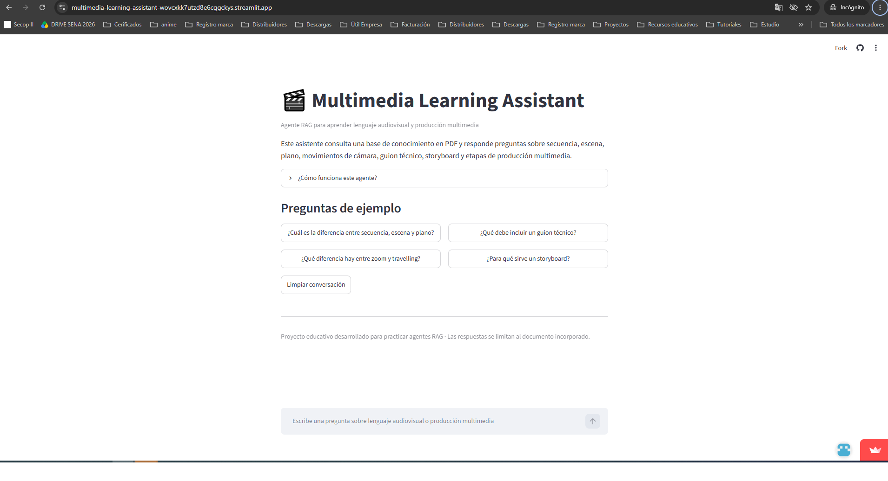
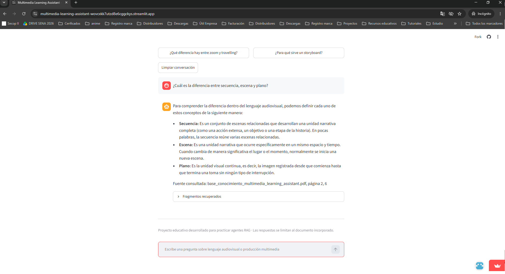
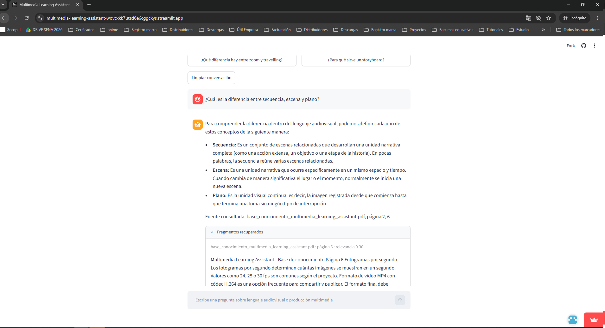
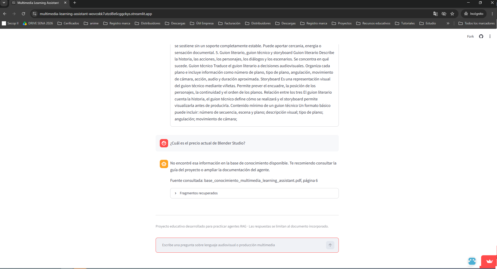

# Evidencias de funcionamiento

En esta carpeta se documentan las pruebas realizadas a **Multimedia Learning Assistant**, un agente creado para responder consultas sobre lenguaje audiovisual y producción multimedia a partir de una base de conocimiento en PDF.

## ¿Qué se validó?

Durante las pruebas se comprobó que el agente:

- Lee y procesa el documento incorporado.
- Recupera fragmentos relacionados con cada pregunta.
- Genera respuestas claras en lenguaje natural.
- Indica el documento y la página utilizados como fuente.
- Reconoce cuando no tiene información suficiente.
- Se encuentra desplegado y accesible mediante una URL pública.

## 1. Pantalla inicial

La pantalla de inicio presenta el propósito del agente, los temas que puede consultar y varias preguntas sugeridas para facilitar las primeras pruebas.

## 2. Diferencia entre secuencia, escena y plano

En esta prueba se consultaron tres conceptos básicos del lenguaje audiovisual.

El agente recuperó la información disponible en el documento y explicó la relación y las diferencias entre secuencia, escena y plano.

## 3. Componentes del guion técnico

Esta consulta permitió comprobar que el agente identifica los elementos principales que debe contener un guion técnico, como la numeración de los planos, la descripción visual, el tipo de plano, la angulación, el movimiento de cámara, el sonido y la duración.

## 4. Control de información no disponible

Se preguntó por el precio actual de Blender Studio, un dato que no forma parte de la base de conocimiento y que puede cambiar con el tiempo.

El agente reconoció que no contaba con esa información y evitó generar una respuesta sin respaldo documental.

## Resultado de las pruebas

Las pruebas confirmaron que la versión inicial de Multimedia Learning Assistant:

- Procesa correctamente la base de conocimiento.
- Responde preguntas relacionadas con desarrollo multimedia.
- Muestra las fuentes consultadas.
- Limita sus respuestas al contenido disponible.
- Evita inventar datos que no aparecen en el documento.
